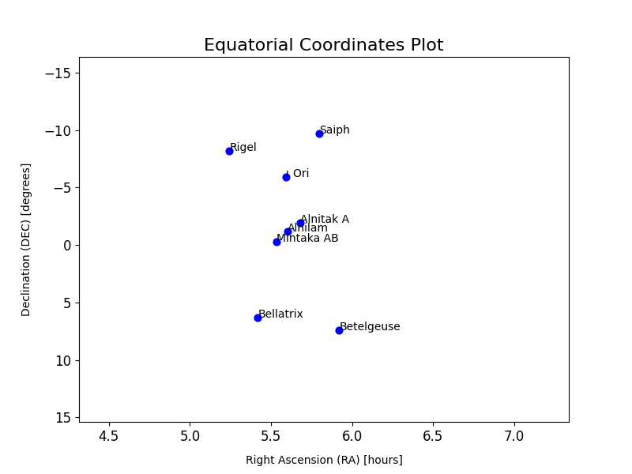

# kosmoplot 🌌 🔭 

**kosmoplot** is a little python application that generates a 3D view of stars constellations.

Take a look at this photo (taken by me) of orion constellation:

This is a only a photo (a good one, but only a photo)

Now a 2D graph with only the most bright stars on orion constellation:

The dots on the graph look like the brightest stars on the orion constellation (like the photo) but it was created using the two localization coordinates `righ ascention` and `declination` from each star. Thanks Math.

---

Now a 3D view of all stars in orion constellation, with the blue dot representing the most bright stars.

Thats the point! Now adding another dimension `distance` we can have an ideia how far the stars are from our point of view (earth) and how far the stars are from each other in the same constellation.
Take a look, for exemple, in the orion's belt (Know as "Três Marias" in Brazil). Although they are very close from our point of view, the "middle" star (alnilam) is more than 550 light years away from the other two.

# Why I created that ?
I created kosmoplot with two main popouse:
1. To help me explain to my 7 years old child (Clarice), who loves Astronomy, that we see the sky night in 2D, and how would it be to see it in 3D. And plus, show the beauty of science.
2. Improve my knowledge in Clean Code, OOP, Develop a API following the Best Practices, and maybe, contribute with the astronomy community some way. Oh, and of course, have fun!